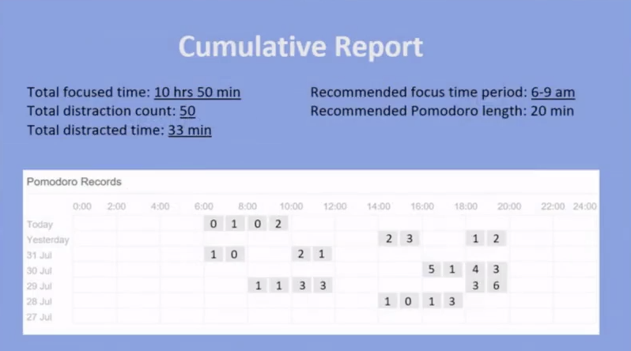

# Focus.AI 
## **1. Overall** 
This webcam-based eye tracking system based on the python library **NumPy**, **OpenCV** and **Dlib**. It gives you the exact position of the pupils direction and the location where the eyes focus on. 
 
## **2. Install Dependency** 
`< pip install -r dependency.txt >` 
## **3. The Basic Direction Idea**  
We compute the number between 0.0 and 1.0 that indicates the horizontal/vertical direction of the gaze. The extreme right is 0.0, the center is 0.5 and the extreme left is 1.0.  
`gaze.horizontal_ratio()` `gaze.vertical_ratio()`  
## **4.The Specific Algorithm** 
`pupil_left = self.eye_left.pupil.x / (self.eye_left.center[0] * 2 - 10)`  
`pupil_right = self.eye_right.pupil.x / (self.eye_right.center[0] * 2 - 10)`  
`(pupil_left + pupil_right) / 2`  
 *   
 *   
## **5.Run the main function** 
`python3 main.py`  
* ## **Preview** 
  * **Start with a Timer** 
    
  * **Finish with a Report** 
    
## The short video for showing the main idea  
  

https://user-images.githubusercontent.com/55170389/128225057-88c2d486-2f36-4cfe-a428-031d33714c36.mp4

## Reference  
**Dataset**  
>  `shape_predictor_68_face_landmarks.dat`  
> The total number of individual identities in the dataset is *7485*  
> The resulting model obtains a mean error of *0.993833* with a standard deviation of *0.00272732* on the LFW benchmark

